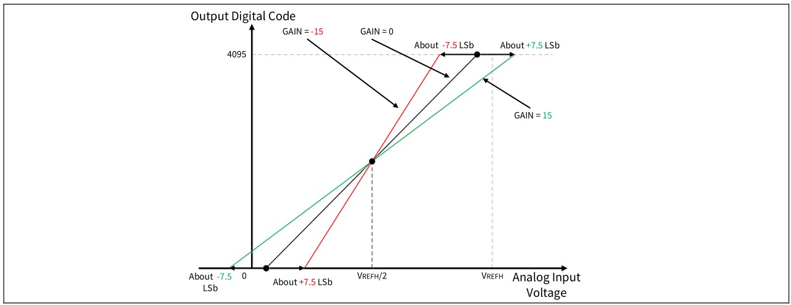

# ADC Calibration

**This code example demonstrates the ADC calibration algorithm.**  

## Device

The device used in this code example (CE) is:
- [TRAVEO™ T2G CYT4BF Series](https://www.infineon.com/cms/en/product/microcontroller/32-bit-traveo-t2g-arm-cortex-microcontroller/32-bit-traveo-t2g-arm-cortex-for-body/traveo-t2g-cyt4bf-series/)

## Board

The board used for testing is:
- TRAVEO™ T2G evaluation kit ([KIT_T2G-B-H_LITE](https://www.infineon.com/cms/en/product/evaluation-boards/kit_t2g-b-h_lite/))

## Scope of work

In this example, the ADC calibration algorithm is executed to find an optimal offset and gain compensation for the ADC. It is also providing the options for decalibration by setting different offset and gain values (boundary values) which result in a decalibrated analog-to-digital transfer curve. A single ADC conversion is showing the voltage level of a potentiometer output while the calibration is done on a different logical ADC channel. 

The ADC calibration is recommended to be executed regularly to compensate for environmental effects (e.g. temperature) on the analog-to-digital transfer curve.

## Introduction  

**ADC calibration**  

TRAVEO™ T2G platform supports the following ADC calibration features:
- Ability to configure offset and gain to make the actual ADC transfer curve come closer to the ideal transfer curve.
- The compensation can be adjusted by an 8-bit (-128 to 127) analog offset and a 5-bit (-15 to 15) analog gain.
- The offset and gain adjustment step is a quarter of 1 LSB.
- Two different register sets for calibration are supported, the regular calibration and the alternate calibration. An update can be triggered to copy the data from the alternate set to the regular set.

More details can be found in [Technical Reference Manual (TRM)](https://www.infineon.com/dgdl/?fileId=5546d4627600a6bc017600bfae720007), [Registers TRM](https://www.infineon.com/dgdl/?fileId=5546d4627600a6bc017600be2aef0004) and [Data Sheet](https://www.infineon.com/dgdl/?fileId=5546d46275b79adb0175dc8387f93228).

## Hardware setup

This CE has been developed for:
- TRAVEO™ T2G evaluation kit lite ([KIT_T2G-B-H_LITE](https://www.infineon.com/cms/en/product/evaluation-boards/kit_t2g-b-h_lite/)) 
   
No changes are required from the board's default settings.

The on-board potentiometer *VR1* can be used to define a voltage level connected to an ADC input channel. It can also be used to prove the success of an ADC calibration.

Please refer to the board schematic for more details on how the potentiometer is connected to the ADC.

## Implementation

This design consists of providing different options: Triggering a single ADC conversion, execution of ADC calibration and changing offset and gain to decalibrate the analog-to-digital transfer curve. The terminal program displays a menu and the user can choose an option by entering the corresponding key.

The ADC block is configured for two logical channels. One is used for ADC conversion of the potentiometer output voltage level. The second channel is used for the ADC calibration where internal reference voltage levels are set as an ADC input.

**STDOUT/STDIN setting**

Initialization of the GPIO for UART is done in the <a href="https://infineon.github.io/retarget-io/html/group__group__board__libs.html#gaddff65f18135a8491811ee3886e69707"><i>cy_retarget_io_init()</i></a> function.
- Initializes the pin specified by *CYBSP_DEBUG_UART_TX* as UART TX and the pin specified by *CYBSP_DEBUG_UART_RX* as UART RX (these pins are connected to KitProg3 COM port)
- The serial port parameters are 8N1 and 115200 baud

**ADC initialization**

API calls for the ADC initialization are done in the *main()* function based on the application note [AN219755](https://www.infineon.com/dgdl/?fileId=8ac78c8c7cdc391c017d0d3aaebf676a).
- Set ePASS MMIO reference buffer mode for bandgap voltage via <a href="https://infineon.github.io/mtb-pdl-cat1/pdl_api_reference_manual/html/group__group__sar2__functions.html#gab2725bd7acf6658c561a1a4614c12c5d"><i>Cy_SAR2_SetReferenceBufferMode()</i></a>
- Enable the Diagnostic Reference via <a href="https://infineon.github.io/mtb-pdl-cat1/pdl_api_reference_manual/html/group__group__sar2__functions.html#gaf5f91292a3e1841b4b86f9e6e6788853"><i>Cy_SAR2_Diag_Enable()</i></a>
- For initialization of the ADC, <a href="https://infineon.github.io/mtb-pdl-cat1/pdl_api_reference_manual/html/group__group__sar2__functions.html#gad6ddc69b82b06fda5952c5da00de35ed"><i>Cy_SAR2_Init()</i></a> is called with appropriate arguments by using macros and configuration structure <a href="https://infineon.github.io/mtb-pdl-cat1/pdl_api_reference_manual/html/structcy__stc__sar2__config__t.html"><i>cy_stc_sar2_config_t</i></a> which are auto-generated by the Device Configurator and can be found in *cycfg_peripherals.h*.

  *Figure 1. ADC configuration* 
- The last step is to enable the ADC by <a href="https://infineon.github.io/mtb-pdl-cat1/pdl_api_reference_manual/html/group__group__sar2__functions.html#gae928dc6cfa80e6ee015be6aac6fc759e"><i>Cy_SAR2_Enable()</i></a>

**ADC calibration menu**

The menu is visible in a terminal and printed in the *printMenu()* function.

**Code example main loop**

The endless loop of the code example in *main()* always checks whether a character has been received from the user via UART (terminal) using <a href="https://infineon.github.io/mtb-hal-cat1/html/group__group__hal__uart.html#ga89108b2d339dc9863ec660588e3a4a12"><i>cyhal_uart_getc()</i></a>. The user interface supports different characters:
- *0* triggers a single ADC conversion of the potentiometer voltage level
- *1* executes the ADC calibration algorithm
- *2* de-calibrates the ADC by setting the offset to 127
- *3* de-calibrates the ADC by setting the offset to -128
- *4* de-calibrates the ADC by setting the gain to 15
- *5* de-calibrates the ADC by setting the gain to -15
- Any other key displays the menu

**ADC single conversion**

A single ADC conversion is started in the *getAdcValue()* function which returns the result of the related conversation of the chosen logical ADC channel. It is called whenever the ADC conversion is triggered by the user (press "0" key) or during the ADC calibration functions *calibrateOffset()* and *calibrateGain()*. It triggers a conversion by calling <a href="https://infineon.github.io/mtb-pdl-cat1/pdl_api_reference_manual/html/group__group__sar2__functions.html#ga07a7023e4f6db655204d25a21b036651"><i>Cy_SAR2_Channel_SoftwareTrigger()</i></a>. Then it waits for the successful completion of ADC conversion by evaluation of <a href="https://infineon.github.io/mtb-pdl-cat1/pdl_api_reference_manual/html/group__group__sar2__functions.html#gae07d8e288f6863cef7e8fa37fa2c0f55"><i>Cy_SAR2_Channel_GetInterruptStatus()</i></a>. Since the ADC conversion has been completed the interrupt is cleared by calling <a href="https://infineon.github.io/mtb-pdl-cat1/pdl_api_reference_manual/html/group__group__sar2__functions.html#ga3038fbd14b4fef98a91a8713c559472d"><i>Cy_SAR2_Channel_ClearInterrupt()</i></a>. The conversion result is read by calling <a href="https://infineon.github.io/mtb-pdl-cat1/pdl_api_reference_manual/html/group__group__sar2__functions.html#ga6cf749ec06d3ab25ce139975f7baafcf"><i>Cy_SAR2_Channel_GetResult()</i></a>.

**ADC calibration algorithm**

The calibration is done in two subsequent steps.
1. ADC offset calibration is executed by calling the function *calibrateOffset()*. It returns "true" when the calibration was successfully performed, and a "false" in case of an error. Associated outputs on the terminal are created (optimal offset or error report). 
The ADC offset calibration sequence is as follows:
    - Set *VREF_L* as source for the channel by changing the ".pinAddress" attribute in <a href="https://infineon.github.io/mtb-pdl-cat1/pdl_api_reference_manual/html/structcy__stc__sar2__channel__config__t.html"><i>cy_stc_sar2_channel_config_t</i></a> to *CY_SAR2_PIN_ADDRESS_VREF_L* and call the init function <a href="https://infineon.github.io/mtb-pdl-cat1/pdl_api_reference_manual/html/group__group__sar2__functions.html#ga20289a8407d268ade39d00c18a7c14b8"><i>Cy_SAR2_Channel_Init()</i></a>. This connects an internal reference low level (0V) to the ADC input.
    - Set the gain correction setting to "0"
    - Change the ADC offset compensation in a loop from *OFFSET_MAX* (127) to *OFFSET_MIN* (-128) by writing to the alternate calibration register using <a href="https://infineon.github.io/mtb-pdl-cat1/pdl_api_reference_manual/html/group__group__sar2__functions.html#ga00e281a1954cef9b30234cf219ea8a69"><i>Cy_SAR2_SetAltAnalogCalibrationValue()</i></a>. 
    - The ideal lower offset *offsetLow* is found when the ADC conversion results in "0"
    - Set *VREF_H* as source for the channel by changing the ".pinAddress" attribute in <a href="https://infineon.github.io/mtb-pdl-cat1/pdl_api_reference_manual/html/structcy__stc__sar2__channel__config__t.html"><i>cy_stc_sar2_channel_config_t</i></a> to *CY_SAR2_PIN_ADDRESS_VREF_H* and call the init function <a href="https://infineon.github.io/mtb-pdl-cat1/pdl_api_reference_manual/html/group__group__sar2__functions.html#ga20289a8407d268ade39d00c18a7c14b8"><i>Cy_SAR2_Channel_Init()</i></a>. This connects an internal reference high-level (5V) to the ADC input.
    - Change the ADC offset compensation in a loop from *OFFSET_MIN* (-128) to *OFFSET_MAX* (127) by writing to the alternate calibration register using <a href="https://infineon.github.io/mtb-pdl-cat1/pdl_api_reference_manual/html/group__group__sar2__functions.html#ga00e281a1954cef9b30234cf219ea8a69"><i>Cy_SAR2_SetAltAnalogCalibrationValue()</i></a>. 
    - The ideal upper offset *offsetHigh* is found when the ADC conversion results in "4095"
    - In the final step, the optimal offset is calculated by the arithmetic mean value between *offsetHigh* and *offsetLow* and some fixed offset  
    *Figure 2. Relationship between OFST and offset shift direction*    
   
2. ADC gain calibration is executed by calling the function *calibrateGain()*. It returns "true" when the calibration was successfully performed, and a "false" in case of an error. Associated outputs on the terminal are created (optimal gain or error report).
The ADC gain calibration sequence is as follows:
    - Set *VREF_L* as source for the channel by changing the ".pinAddress" attribute in <a href="https://infineon.github.io/mtb-pdl-cat1/pdl_api_reference_manual/html/structcy__stc__sar2__channel__config__t.html"><i>cy_stc_sar2_channel_config_t</i></a> to *CY_SAR2_PIN_ADDRESS_VREF_L* and call the init function <a href="https://infineon.github.io/mtb-pdl-cat1/pdl_api_reference_manual/html/group__group__sar2__functions.html#ga20289a8407d268ade39d00c18a7c14b8"><i>Cy_SAR2_Channel_Init()</i></a>. This connects an internal reference low level (0V) to the ADC input.
    - Change the ADC gain compensation in a loop from *GAIN_MAX* (15) to *GAIN_MIN* (-15) by writing to the alternate calibration register using <a href="https://infineon.github.io/mtb-pdl-cat1/pdl_api_reference_manual/html/group__group__sar2__functions.html#ga00e281a1954cef9b30234cf219ea8a69"><i>Cy_SAR2_SetAltAnalogCalibrationValue()</i></a>. 
    - The ideal gain is found when the ADC conversion results in "0"     
    *Figure 3. Relationship between GAIN and gain shift direction*   
    
The ADC is supporting two sets of ADC calibration registers. One regular register is used for the ADC conversions in the user's regular software flow and the alternate register set for ADC calibration in the background. After the ADC calibration was successfully performed, the data in the alternate register set can be copied into the regular calibration set by calling <a href="https://infineon.github.io/mtb-pdl-cat1/pdl_api_reference_manual/html/group__group__sar2__functions.html#ga6a00e61ed457bdd7c579a8dfff2a1835"><i>Cy_SAR2_TriggerCalibrationUpdate()</i></a>.

**ADC decalibration**

To prove the behavior of ADC, the offset and gain can be decalibrated by writing some boundary values to the regular calibration register set via <a href="https://infineon.github.io/mtb-pdl-cat1/pdl_api_reference_manual/html/group__group__sar2__functions.html#ga2a2919b5813338f4c40a74246cef135e"><i>Cy_SAR2_SetAnalogCalibrationValue()</i></a>.
After changing the offset or gain, the analog-to-digital transfer curve should be decalibrated and showing irregular ADC conversion data.

## Run and Test

For this example, a terminal emulator is required for displaying outputs and to change settings during runtime. Install a terminal emulator if you do not have one. Instructions in this document use [Tera Term](https://ttssh2.osdn.jp/index.html.en).

After code compilation, perform the following steps for flashing the device:
1. Connect the board to your PC using the provided USB cable through the KitProg3 USB connector.
2. Open a terminal program and select the KitProg3 COM port. Set the serial port parameters to 8N1 and 115200 baud.
3. Program the board using one of the following:
    - Select the code example project in the Project Explorer.
    - In the **Quick Panel**, scroll down, and click **[Project Name] Program (KitProg3_MiniProg4)**.
4. After programming, the code example starts automatically. Confirm that the messages are displayed on the UART terminal:

   *Figure 4. Terminal output on program startup* 
    
**Expected behavior**

For demonstration purposes, the following actions are done. The ADC conversion results may vary on different hardware. 
- Set the potentiometer to the lower (clockwise) limit to connect a *0V* voltage level to the ADC input.
- Press the "0" key to start an ADC conversion which should result in "0".
- Press the "2" key to decalibrate the ADC with an offset equal to the maximum offset value.
- Press the "0" key to start an ADC conversion which should result in a value > "0" ("27" in this example)
- Press the "4" key to decalibrate the ADC with a gain equal to the maximum gain value. 
- Press the "0" key to start an ADC conversion which should result in a value > "0" ("36" in this example)
- Press the "1" key to execute the ADC calibration algorithm. The ideal values for offset and gain will be printed on the terminal
- Press the "0" key to start an ADC conversion which should result in "0".
- Set the potentiometer to the upper (counter-clockwise) limit to connect a 5V voltage level to the ADC input.
- Press the "0" key to start an ADC conversion which should result in "4095".   
*Figure 5. Terminal output for the sequence described above* 

## References  

Relevant Application notes are:
- AN235305 - GETTING STARTED WITH TRAVEO™ T2G FAMILY MCUS IN MODUSTOOLBOX™
- [AN219755](https://www.infineon.com/dgdl/?fileId=8ac78c8c7cdc391c017d0d3aaebf676a) - USING A SAR ADC IN TRAVEO™ T2G AUTOMOTIVE MICROCONTROLLERS

ModusToolbox™ is available online:
- <https://www.infineon.com/modustoolbox>

Associated TRAVEO™ T2G MCUs can be found on:
- <https://www.infineon.com/cms/en/product/microcontroller/32-bit-traveo-t2g-arm-cortex-microcontroller/>

More code examples can be found on the GIT repository:
- [TRAVEO™ T2G Code examples](https://github.com/orgs/Infineon/repositories?q=mtb-t2g-&type=all&language=&sort=)

For additional training, visit our webpage:  
- [TRAVEO™ T2G training](https://www.infineon.com/cms/en/product/microcontroller/32-bit-traveo-t2g-arm-cortex-microcontroller/32-bit-traveo-t2g-arm-cortex-for-body/traveo-t2g-cyt4bf-series/#!trainings)

For questions and support, use the TRAVEO™ T2G Forum:  
- <https://community.infineon.com/t5/TRAVEO-T2G/bd-p/TraveoII>  
